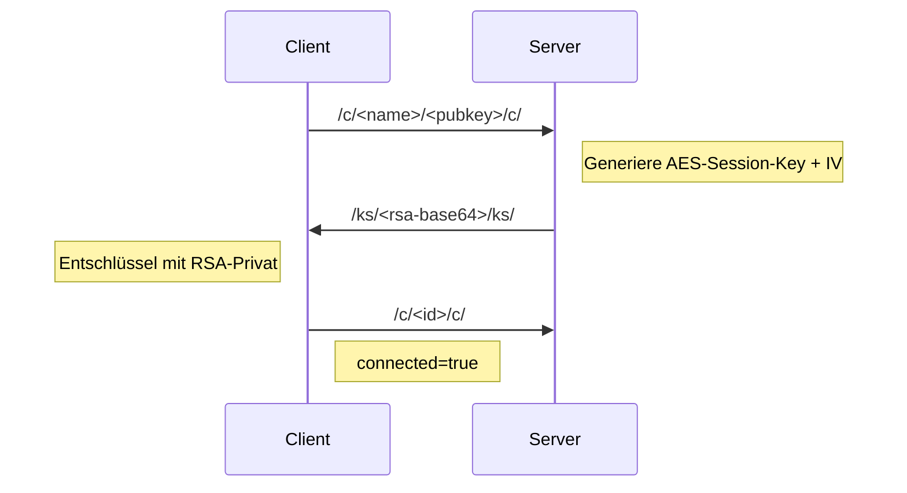

# Erstellen

```
$ docker build -t rain-network-server .

$ docker run -e PORT=8182 -p 8182:8182/udp rain-network-server
```

## Kommunikation im Protokoll

Der Server und Client kommunizieren per UDP mit einfachen Paket-Tags:

- `/c/<name>/<pubkey>/c/` : Client-Handshake (sendet Benutzername + RSA-PublicKey URL-sicher)
- `/ks/<payload>/ks/` : Server-Antwort mit symmetrischem Schlüssel, RSA-verschlüsselt und URL-safe kodiert
- `/c/<id>/e/` : Server bestätigt Verbindungs-ID
- `/e/<base64>/e/` : alle verschlüsselte Nachrichten Anwendungspayload (AES-CFB8 + Standard Base64)
- `/m/<text>/m/` : Chat-Nachricht (klartext, wenn kein Handshake)
- `/u/` : Nutzerliste anfordern
- `/i/<id>/i/` : Keepalive-Ping/Pong
- `/d/<id>/d/` : Trennen

### Ablauf beim Client-Login

1. Client generiert RSA KeyPair.
2. Client sendet `/c/<name>/<pubkey>/c/` an den Server.
3. Server erstellt neuen Client-Eintrag mit ID und generiert AES-Schlüssel + IV.
4. Server verschlüsselt den symmetrischen Token `SYMMETRIC:<id>:<key>:<iv>` mit RSA PublicKey des Clients.
5. Server sendet `/ks/<urlsafe-base64-rsa>/ks/`.
6. Client entschlüsselt mit eigenem RSA PrivateKey.
7. Client speichert AES-Schlüssel + IV und markiert Handshake abgeschlossen.
8. Server sendet `/c/<id>/c/` zur Bestätigung.

### Handshake-Sequenzdiagramm



## Verschlüsselung

- RSA (3072 Bit) wird nur zur Schlüsselaushandlung verwendet.
- Symmetrische Nachrichtencodierung nutzt AES/CFB8/NoPadding.
- Verschlüsselte Chat-Payload wird mit Standard-Base64 (`Base64.getEncoder()/getDecoder()`) kodiert.
- RSA-Keys und `SYMMETRIC:` Token im Handshake werden URL-safe Base64 kodiert (`Base64.getUrlEncoder().withoutPadding()`).

## Warum verwenden wir IV + Session Key, wenn Public Key genug scheint?

RSA ist stark, aber für den Dauerbetrieb nicht ideal:

1. RSA ist viel langsamer als AES. Für jede Chatnachricht wäre es ineffizient.
2. RSA sollte nicht zum Verschlüsseln grosser oder häufiger Datenmengen verwendet werden.
3. Mit RSA allein kann ein Angreifer bei Neukeys Replay oder CPU-Angriffe forcieren.

Darum nutzen wir eine hybride Verschlüsselung:

- RSA schützt nur den einmaligen Schlüsselaustausch (`/ks/`).
- Server sendet AES-Sessionkey + IV verschlüsselt an den Client.
- Danach verschlüsseln Client und Server Nachrichten mit AES/CFB8 (schnell, geeignet für Streaming).

Der IV wird benötigt, weil CFB8 eine Initialisierungsphase braucht und sonst ähnliche Klartextblöcke zu identischen Ciphertextblöcken führen könnten.
Durch IV + Schlüssel werden gleiche Nachrichten unterschiedlich verschlüsselt und die Verbindung bleibt sicher.

## Nachrichten-Lesbarkeit

- Nach vollständigem Handshake (`/c/<id>/c/` + `/ks/`) werden nachfolgende Pakete zu `/e/<base64>/e/` verschlüsselt/entschlüsselt und dann intern auf `/m/`, `/u/`, `/i/`, `/d/` geprüft.
- Keepalive: Server schickt `/i/server/i/`, Client antwortet `/i/<id>/i/`.

## Fehlervermeidung

- Prüft Paketgrenzen (`lastIndexOf("/e/")`) bevor Kodierung/Entschlüsselung.
- Gültigkeitsprüfungen verhindern Crash durch falsche Base64-Strings.

# VoiceChat
Der VoiceChat ist eine weitere Art zu komminuzieren mit anderen Clients.
Die Audiodaten werden wie gewöhnliche Nachrichten behandelt und auf die gleiche weise Verschlüsselt.
Für einen nicht kommerziellen Client ist das mehr als genug -   
es sollte jedoch nicht in der Praxis dieselbe Verschlüsselung verwendet werden für Nachrichten als auch Audio.

# Releases
Zurzeit gibt es für die 3 Hauptbetriebssysteme jeweils 1 Release pro Commit auf dem Master branch.   
Linux-, Macos- sowie Windowsbuilds funktionieren.  
__Windows muss derzeitig manuell auf einem Windows basierten Rechner paketiert werden, damit die Eingabe- und Ausgabegeräte funktionieren für Audio.__ 


# In Arbeit
VoiceChat windows.
